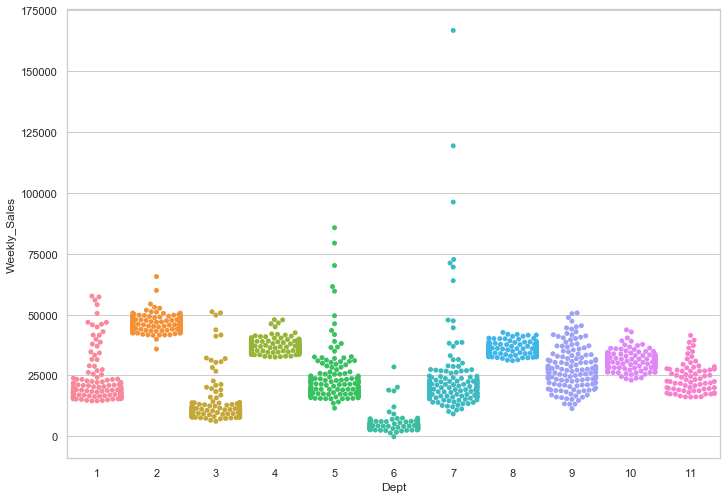
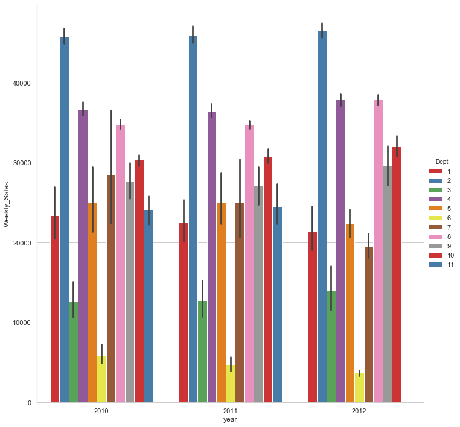
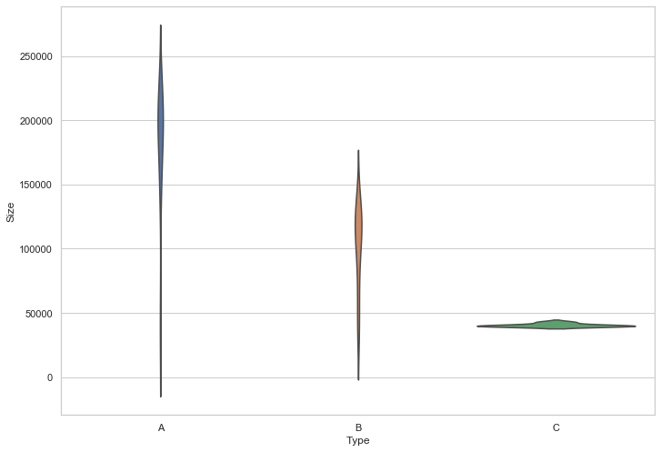
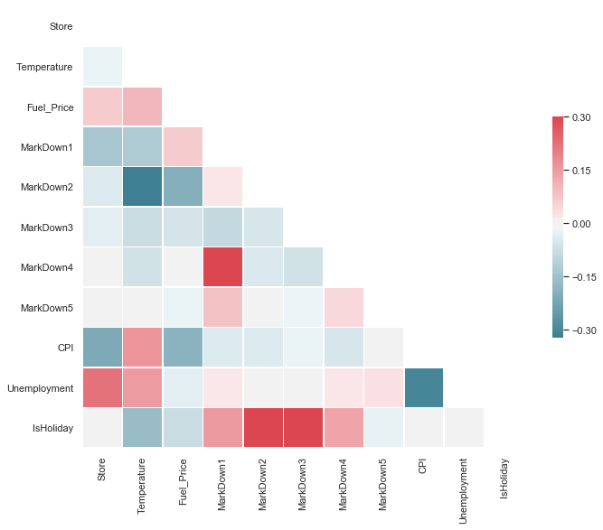
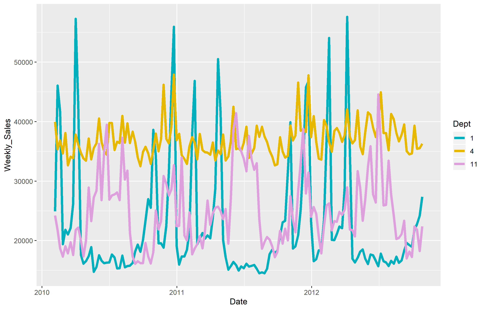
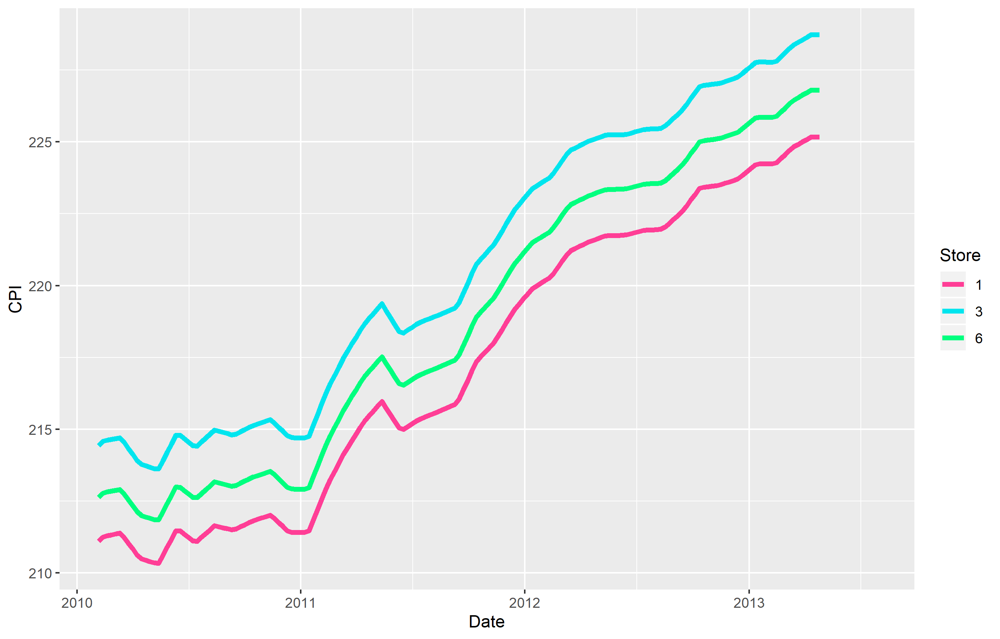

# Exploratory Retail Insights

## Background

In both data science and business settings, data visualization is critical for understanding underlying data structure and making accurate predictions. Using computational methods, data visualization can occur quickly-- even when using large data sources. There are many examples of scientific data visualzations on my portfolio. Below are a few examples of data visualzations in R and Python using a sample retail dataset.

**Data:** 
* [Store Features](./shopping/features-data-set.csv)
* [Store Sales](./shopping/sales-data-set.csv)

### Python

### Average Weekly Department Sales for 2010-2012

[View Python Code](https://github.com/sstockard/sstockard.github.io/blob/master/shopping/sales2.py)

What this figure tells us: 

* Dept 2 had the highest weekly sales during this time period, with a range of about $40-50k in sales per week and little volatality. This Dept may contain products that have little seasonality (food items).

* Weekly sales are most volatile for Dept 9. This Dept likely has products with more seasonality (clothing). 

#### Average Weekly Deptartment Sales 2010-2012 for 11 Departments By Year
[View Python Code](https://github.com/sstockard/sstockard.github.io/blob/master/shopping/barchart.py)

What this figure tells us: 

* There is little change in sales from year to year per department.

* The top selling and bottom selling departments remained as so for each year.

* Sales in Dept 6 and Dept 7 have steadily decreased from 2010 to 2012.

### Store Size per Store Type

[View Python Code](https://github.com/sstockard/sstockard.github.io/blob/master/shopping/size.py)

     
#### Correlations Between Retail Factors
[View Python Code](https://github.com/sstockard/sstockard.github.io/blob/master/shopping/corrplot.py)

* Positive correlation between Markdowns 1-4 and occurance of a holiday, but a very slight negative correlation between Markdown 5 and holiday occurance.

* While there aren't many notable correlations in this dataset, corrplots are a way to quickly visualize many possible correlations at once in exploratory analyses.

### R

#### Weekly Sales 2010-2012 for 3 Departments
[View R Code](https://github.com/sstockard/sstockard.github.io/blob/master/shopping/weeklysales.R)

What this figure tells us: 

* Dept 1 has sales peaks around the New Year and early spring.

* Dept 4 has small peaks throughout the year and a larger peaks around the holidays.

* Dept 11 has peaks around the Holiday Season from Thanksgiving to New Years.

#### CPI 2010-2012 for 3 Departments
[View R Code](https://github.com/sstockard/sstockard.github.io/blob/master/shopping/cpi.R)

What this figure tells us: 

* While CPI follows the same trend for all departments, stores have slightly differing CPI values throughout the year, due to the prices and nature of the goods in the department.

* CPI increases steadily over the years.

* There is a sharp rise in CPI beginning in 2011, and a notably large peak around April/May 2011 before it falls again.
