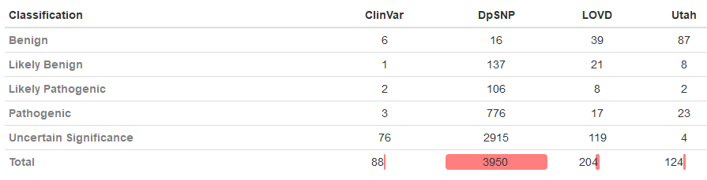
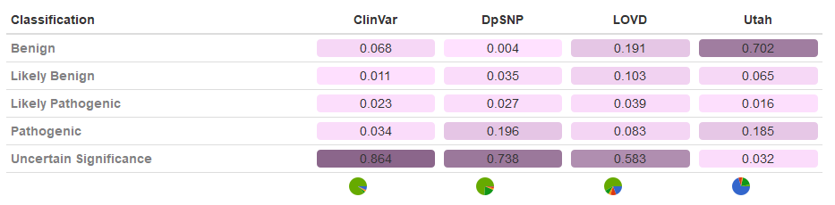
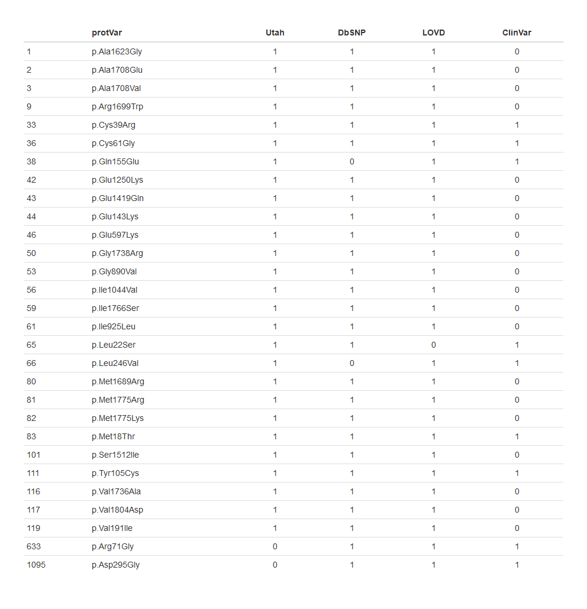
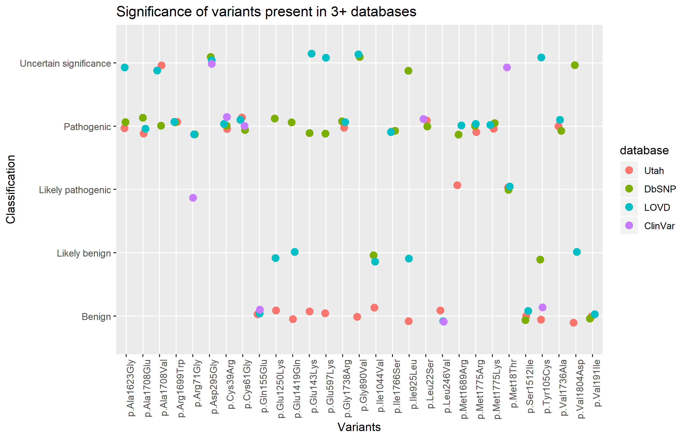

# Discrepancies in Variant Databases for BRCA1 Mutations

**Language:** R

**Concepts:**: Genomics, data manipulation, merging data sources, querying, visualization

**[Full code](/variants/variants.html)**

## Background 

Deoxyribonucleic acid, more commonly known as DNA, is the blueprint for all life on Earth. DNA is found in cells and determines the characteristics that make every person unique. For simplicity, we can think of DNA as long strands of molecules called _bases_. There are four bases: G, T, C, and A. Normally, cells replicate and copy their DNA accurately. But sometimes there are mistakes. These mistakes are called _mutations_ or _variants_.

Some mutations are harmful and can cause diseases such as cancer. These are called _pathogenic mutations_. However, other mutations are harmless and have no negative effects. These are called _benign mutations_. It is now possible to recieve a DNA test from a doctor to screen for mutations that may impact health. Databases exist that classify mutations as pathogenic, benign, or unknown based on results of laboratory experiments. But do these databases agree? 

## The Dataset

BRCA1 is a gene commonly mutated in breast cancer. It is made up of many bases, so there are many opportunities for mutations. 

**4 BRCA1 mutant databases were explored:** 

* [ClinVar](/variants/ClinVar.csv)
* [DbSNP](/variants/dbSNP.tsv)
* [LOVD](/variants/LOVD.tsv)
* [University of Utah](/variants/Utah.tsv)

**Clinical classifications of variants:** 

* Pathogenic
* Likely Pathogenic
* Benign
* Likely Benign 
* Unknown significance- This means experimental data exists on the variant, but results are mixed. It is NOT the same as an NA value.

## Impacts

**Clinical:** If a BRCA1 mutation is found during a genetic screening of a patient, patients are faced with anxiety and the decision to take preventative measures. For breast cancer, this could mean undergoing a masectamy to reduce the chances of developing a breast tumor. However, such extreme consequences should only occur in the case of a _pathogenic mutation_. For this reason, it is important that genomic variant databases are accurate as possible so patients can make the most informed decision for their health.

**Business:** The ability to merge, cross-validate, and visualize findings across datasets is a valuable tool in a business setting.

## First look: query the databases

First, let's see what the data looks like. 

#### Raw Counts of Clinical Classifications Across Databases


DbSNP is the largest variant database by far. But how are the clinical classifications distributed?

#### Distributions of Clinical Classifications Across Databases

###### See interactive version of this table in R markdown file (linked at top of page).

Most of the varients in the ClinVar, DbSNP, and LOVD databases are classified as unknown. By contrast, a majority of the variants in the Utah database are classified as benign. 

## Variant overlap across databases

By looking at the [merged variant database](/variants/Merged.txt), one can see that there are hundreds of missing values (i.e. "NA"). A missing value in a column means that there is no experimental data for that variant in that particular database. 

If we want to compare variant classifications across databases, we have to determine which variants are present in multiple databases. Here, we will say that we are interested variants that 3 out of 4 of the databases. 

One way to do this is to set NA values to 0, and variant call values to 1. Since the mutation names are rows and the databases are columns, a row sum of 3 or above means that the variant is present in at least 3 databases.

#### Example:
```{r}
mergedz <- read.csv("Merged.txt", 
  header=FALSE, skip = 1, 
  col.names = c("protVar", "Utah", "DbSNP", "LOVD", "ClinVar"), 
  sep='\t', stringsAsFactors = FALSE)

# set NA's = 0
mergedz[is.na(mergedz)] <- 0

#set calls to = 1
mergedz[mergedz == 'Benign'] <- 1 
mergedz[mergedz == 'Likely benign'] <- 1 
mergedz[mergedz == 'Likely Pathogenic'] <- 1 
mergedz[mergedz == 'Pathogenic'] <- 1 
mergedz[mergedz == 'Uncertain significance'] <- 1 

# get row sums
mergedz$sum <- rowSums(mergedz[,2:5])

```
These are the variants that exist across at least 3 databases. There are only 29! This is a very small number compared to the total number of variants we started with (over 3800), which shows how little is known about the effects of specific BRCA1 variants. 

#### Names of Variants Found in at Least 3 Databases


For the variants found in at least 3 databases, are they classified similarly across databases?

#### Clinical Classifications of Variants Found in at Least 3 Databases


This plot shows that there is fairly good agreement among variant calls across databases, but still some discrepancies and many unknown variants in some databases. This suggests that while variant calling databases can be a good resource, there is still some uncertanity in the field about the health implications of specific BRCA1 mutations. This is especially true given the small amount of variants that are available in multiple databases.

## Conclusions

* There are very few common variants across databases that have clinical calls.
* Among those with clinical calls, there is some agreement among databases.
* Lack of consistancy and availability of BRCA1 variant data could have negative impacts on patient care, so more experimental and computational work needs to be done to accurately classify BRCA1 mutations.


